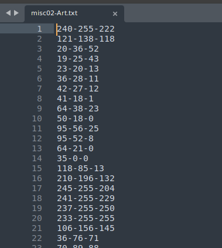
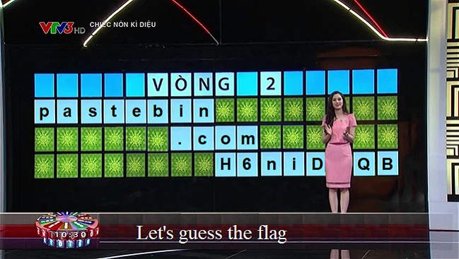
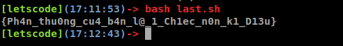

# Problem
- Name: Art
- Point: 128
- Solved: 48
- Description:
  ```sh
  The best thing about a picture is that it never changes, even when the people in it do, or when it is zoomed in
  Download file here:
  https://drive.google.com/file/d/1J7It1RTd6lSLi-nVqnbAQJn_fuA_PnPj/view?usp=sharing

  Author: █Bquanman█#1805
  ```

# Solution
- Sau khi tải file về  ta được 1 file [misc02-Art.txt](challenge/misc02-Art.txt). Sau khi mở file này ra, bằng kinh nghiệm đã từng đọc 7749 cái writeup, ta có thể  biết được mỗi dòng sẽ gồm 3 số, mỗi số sẽ chạy từ 0-255, hay nói cách khác mỗi số sẽ đại diện 1 byte, và khi liên kết 3 bytes lại với nhau ta được 1 pixel của 1 bức ảnh.

    

- Đến đây thì ta có thể thấy file này có 238183 dòng (hoặc bạn có thể dùng **wc -l misc02-Art.txt**), có nghĩa là bức ảnh sẽ gồm 238183 pixel. Đến đây nhẩm tí thì ra 6 cặp chiều dài và chiều rộng của bức ảnh: 11x21653, 59x4037, 367x649 và ngược lại (đơn vị pixel).
- Giờ thì chỉ việc code 1 hàm python để  tạo ra 1 bức ảnh từ 238183 pixel thôi.
  ```python
  from PIL import Image
  import numpy as np

  # 6 bức hình với size khác nhau nhưng vẫn đảm bảo diện tích là 238183
  size = [[11,21653], [59,4037], [367,649], [649,367], [4037,59], [21653,11]]

  # cái list này để chứa toàn bộ pixel sau khi được xử lý từ file .txt
  lpixel = []

  # Mở file xử lý data trong đó các kiểu rồi lưu vào biến lpixel
  f = open("misc02-Art.txt")
  for line in f:
  	pixel = line.strip().split("-")
  	lpixel.append(pixel)

  # hàm này để tạo bức ảnh với các tham số lần lượt
  # name: tên của bức ảnh sẽ được tạo
  # pixels: list pixel sẽ được load vào bức ảnh
  # height,width: chiều cao và chiều dài của bức ảnh
  def gen_picture(name, pixels, height, width):
  	array_pixel = []
  	index = 0
  	for i in range(height):
  		tmp = []
  		for j in range(width):
  			tmp.append(pixels[index])
  			index += 1
  		array_pixel.append(tmp)
  	array_pixel = np.array(array_pixel, dtype=np.uint8)
  	new_image = Image.fromarray(array_pixel)
  	new_image.save(name)

  # 6 bức ảnh thì chạy for 6 lần thôi
  for i in range(len(size)):
  	h, w = size[i][0], size[i][1]
  	name = str(h) + "x" + str(w) + ".png"
  	gen_picture(name, lpixel, h, w)

  ```

- Sau khi chạy xong đoạn code trên ta thu được 6 bức ảnh trong đó có 1 bức chứa 99.99% cái link dẫn đến flag.

  

- Đến đây thì mình có dùng Python để code 1 đoạn bruteforce cái link đấy rồi gởi request đi nhưng tạch vì cứ bị thằng cloudflare bắt giải captcha :TT

  ```python
  import string
  import requests

  flag1 = "H6niD"
  flag2 = "QB"

  dic = string.ascii_uppercase + string.digits + string.ascii_lowercase

  url = "https://pastebin.com/raw/"
  for i in dic:
  	url_tmp = url + flag1 + i + flag2
  	try:
  		r = requests.get(url)
  		print(r.text)
  	except:
  		continue

  ```

- Thế là phải chuyển qua bash script để sài curl ... và kết quả là lần này chúng ta lấy được flag.
  ```sh
  #! /bin/bash

  url="https://pastebin.com/raw/"
  dic='ABCDEFGHIJKLMNOPQRSTUVWXYZ0123456789abcdefghijklmnopqrstuvwxyz'

  for (( i=0; i<${#dic}; i++ ))
  do
    result=`curl $url"H6niD"${dic:$i:1}"QB" 2>/dev/null`
    if [[ $result != *"Not Found"* ]]
    then
    	echo $result
    	exit 0
    fi

  done

  ```

  

# "After Credit"
- Cái này code đoạn bash làm màu tí thôi :vv

  ```sh
  #! /bin/sh

  red=`tput setaf 1`
  green=`tput setaf 2`
  yellow=`tput setaf 3`
  reset=`tput sgr0`

  function ctrlc(){
	   echo -e "\n${red}Ctrl-C caught. Quiting!${reset}"
	    exit 1
    }
    trap "ctrlc" 2

    # Here we go
    url="https://pastebin.com/raw/"
    dic='ABCDEFGHIJKLMNOPQRSTUVWXYZ0123456789abcdefghijklmnopqrstuvwxyz'

    for (( i=0; i<${#dic}; i++ ))
    do
      try_url=$url"H6niD"${dic:$i:1}"QB"
      echo -ne "\r${yellow}Trying URL: $try_url $reset"
      result=`curl $try_url  2>/dev/null`
      if [[ $result != *"Not Found"* ]]
      then
        echo -e "\n${green}Data is: $result $reset"
        exit 0
      fi
    done

    echo "${red}Try again ${reset}"
    exit 1

    <<COMMENT-1
    Link: https://unix.stackexchange.com/a/269085
    Color       #define       Value       RGB
    black     COLOR_BLACK       0     0, 0, 0
    red       COLOR_RED         1     max,0,0
    green     COLOR_GREEN       2     0,max,0
    yellow    COLOR_YELLOW      3     max,max,0
    blue      COLOR_BLUE        4     0,0,max
    magenta   COLOR_MAGENTA     5     max,0,max
    cyan      COLOR_CYAN        6     0,max,max
    white     COLOR_WHITE       7     max,max,max
    COMMENT-1

    <<COMMENT-2
    [letscode](13:30:10)-> kill -l
    1) SIGHUP	 2) SIGINT	 3) SIGQUIT	 4) SIGILL	 5) SIGTRAP
    6) SIGABRT	 7) SIGBUS	 8) SIGFPE	 9) SIGKILL	10) SIGUSR1
    11) SIGSEGV	12) SIGUSR2	13) SIGPIPE	14) SIGALRM	15) SIGTERM
    16) SIGSTKFLT	17) SIGCHLD	18) SIGCONT	19) SIGSTOP	20) SIGTSTP
    21) SIGTTIN	22) SIGTTOU	23) SIGURG	24) SIGXCPU	25) SIGXFSZ
    26) SIGVTALRM	27) SIGPROF	28) SIGWINCH	29) SIGIO	30) SIGPWR
    31) SIGSYS	34) SIGRTMIN	35) SIGRTMIN+1	36) SIGRTMIN+2	37) SIGRTMIN+3
    38) SIGRTMIN+4	39) SIGRTMIN+5	40) SIGRTMIN+6	41) SIGRTMIN+7	42) SIGRTMIN+8
    43) SIGRTMIN+9	44) SIGRTMIN+10	45) SIGRTMIN+11	46) SIGRTMIN+12	47) SIGRTMIN+13
    48) SIGRTMIN+14	49) SIGRTMIN+15	50) SIGRTMAX-14	51) SIGRTMAX-13	52) SIGRTMAX-12
    53) SIGRTMAX-11	54) SIGRTMAX-10	55) SIGRTMAX-9	56) SIGRTMAX-8	57) SIGRTMAX-7
    58) SIGRTMAX-6	59) SIGRTMAX-5	60) SIGRTMAX-4	61) SIGRTMAX-3	62) SIGRTMAX-2
    63) SIGRTMAX-1	64) SIGRTMAX
    COMMENT-2

    <<COMMENT-3
    Link: https://www.youtube.com/watch?v=8EGDxMgNRs0&ab_channel=AlexLynd
    COMMENT-3

    ```

    
